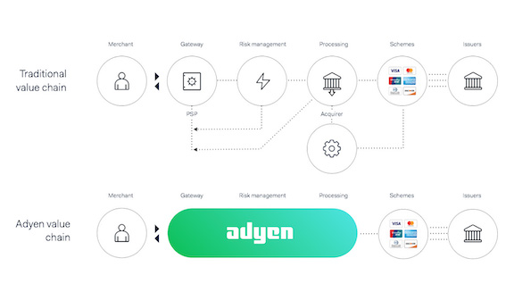

# **Adyen: The payments platform built for growth**
*A Case Study by Steffen Westerburger, March 2020*

## **Overview and Origin**

* **Name of company**

    [Adyen N.V.](www.adyen.com) (Euronext: [ADYEN](https://live.euronext.com/en/product/equities/NL0012969182-XAMS))

* **When was the company incorporated?**

    The company was in incorporated in 2006. Adyen announced on May 24th 2018 their intention to go public. The IPO took place on June 13th 2018 when they listed as ADYEN on Euronext Amsterdam. They are headquarted in Amsterdam, The Netherlands and employ more than 1,400 employees in twenty-one offices around the world.[1](https://www.adyen.com/about)

* **Who are the founders of the company?**

    Adyen was founded by a two seasoned payment industry professionals: [Mr. Pieter van der Does](https://www.linkedin.com/in/pieter-van-der-does-4824b11/) and [Mr. Arnout Schuijff](https://www.linkedin.com/in/arnoutschuijff/). Van der Does currently serves as CEO and Schuijff is CTO.

* **How did the idea for the company (or project) come about?**

    >**Adyen: afresh, again, all over again**

     *Sranantongo, Suriname's mostly used language*       

    It is no coincidence the founders specificaly named their new company Adyen: to do it all over again. Van der Does and Schuijff previously founded a payment operator company called Bibit, which was acquired by Royal Bank of Scotland in 2004 for €001MM. Exactly two years later - on the day their *lock-up* period expired - they decided they wanted to 'start all over again'. The result? Adyen.
    
    Bibit started as a billing platform for small amounts of content. Amsterdam-based exchange AEX was one of the first customers using Bibit to sell financial information. Later on Bibit pivoted into payments and became on of the first companies to process the growing number of online payments as a result of the growing e-business model.[2](https://startupjuncture.com/2014/01/22/payments-startup-adyen) 

    Bibit showcased the enormous potential in the online payment industry. It was time to work on a next generation platform. 

    >*'Bibit was cutting-edge when it was acquired by RBS, but after three years of stagnation, I and others decided that we wanted to work on a next generation platform*[3](https://startupjuncture.com/2014/01/22/payments-startup-adyen) 

    *Roelant Prins - Chief Commercial Officer*

    
    
                                   
* **How is the company funded? How much funding have they received?**

    The fact that Adyen's two co-founders Pieter van der Does and Arnout Schuijff sold their previous company Bibit to Royal Bank of Schotland for €100MM, for a long time ensured sufficient funding for newely founded Adyen. It was only in September of 2011 (five years after they founded the company!) when they raised their first additional capital of €16MM. In subsequent years they closed several other funding rounds. In 2015 they closed their last funding round with Iconiq Capital and were valued at $2.3BN. In total they raised $282MM before going public in 2018.[4](https://www.crunchbase.com/search/funding_rounds/field/organizations/funding_total/adyen) 

## **Business Activities:**

* **What specific financial problem is the company or project trying to solve?**

    On their website Adyen describes how *'from gold to digital wallets, payments have always evolved'*.[5](https://www.adyen.com/blog/how-the-payments-industry-evolved) With online commerce skyrocketing, the world of online payments is becoming more and more complex. The online payment industry is a crowded space, where hundreds of companies are competing and '*carving up the online payment process into smaller, more intricate digital parts*'. 

    >### **A little history: online payments** 
    >With rapidly growing e-commerce activity, payment gateways started sending skyrocketing numbers of transactions to payment processors. As an effect payment gateways flourished and started specializing in different merchant verticals. This gateway specialization came to the detriment of payment processors, which in turn needed to own or partner with several different gateways to serve their entire customer base.

    Adyen is presented as the solution to this fragmented online payment value chain. Instead of the traditional value chain, Adyen offers a product that encompasses the complete payments value chain. This results in an encompassing end-to-end solution. It enables their customers to manage their entire payment flow from checkout to final settlement. Adyen is payment gateway, risk management system and acquirer - basically serving as a middleman between merchants and payment groups.
    
     Analysts have often noted that its main strength lies in offering a solution for complex payment problems, for example combining multiple currencies and multiple payment methods among different geographies.[6](https://www.fool.com/investing/2020/01/06/will-new-product-help-adyen-make-its-expansion-pla.aspx)

     Adyen simply promises to: '*streamline your operations, reduce costs, and optimize results.'*

    

    On top of the 'core' business of Adyen of global acquiring, payment methods and risk management, it has also started offering revenue optimization and customer insights services. 

* **Who is the company's intended customer?  Is there any information about the market size of this set of customers?
What solution does this company offer that their competitors do not or cannot offer? (What is the unfair advantage they utilize?)**

    Adyen's goal is to serve as a platform to simplify and accelerate global payments - both online and offline. It aims to be a single payments platform that accepts payments anywhere, on any device.[7](https://www.adyen.com/customers) Many Fortune500 companies such as Uber, LinkedIn, Microsoft and eBay use Adyen's product. 

    Adyen's integrated approach is what sets them apart from their biggest competitors, such as PayPal, Stripe and Alipay. Adyen is able to offer a one-stop shop approach, where competitors only handle a small part in the value chain. [8](https://www.adyen.com/customers) The aforementioned full-stack platform and its suport of many different payment methods are key differentiating factors.

    American based market research company Forrester summarized the key benefits for customers in implementing Adyen's platform in their most recent report *The Forrester Wave: Global Merchant Payment Providers*[9](https://go.forrester.com/press-newsroom/the-forrester-wave-global-merchant-payment-providers-q4-2018/):

    - 106% risk-adjusted ROI over 3 years and payback of initial investment within 6 months.
    - 70% improvments in productivity because od reduced number of payment partner and platforms.
    - 50% efficiency gained because of possibility to accept payments in new markets.
    - 40% less declined transactions as an effect of improved auhorization rates.

    Adyen is operating in the rapidly growing industry of (international) payments. This sector is estimated to grow with a compound annual growth rate (CAGR) of 12% till 2024. According to SeekingAlpha the number of transactions is projected to grow over the next ten years: in Western Europe and North America they are projected to double, in Asia-Pacific it might even be a five-fold increase. 

    Does this mean Adyen is set up for further growth and success? They might very well be. Adyen and its main competitors currently hold about 80% of the payments market. In recent years some of Adyen's biggest competitors, for example PayPal, have grown rapidly by acquiring smaller companies and thus expanded their service offerings. Althought this might turn out to be a profitable strategy in the long run, it sure could also negatively impact them because of it can further complicate their technology stack. So far Adyen has chosen a different path: by growing their product organically. 

* **Which technologies are they currently using, and how are they implementing them? (This may take a little bit of sleuthing–– you may want to search the company’s engineering blog or use sites like Stackshare to find this information.)**

## **Landscape:**

* **What domain of the financial industry is the company in?**

    Adyen operates in the payments services domain within the financial technology industry.[15](https://stackshare.io/adyen)

* **What have been the major trends and innovations of this domain over the last 5-10 years?**

    As mentioned before, from gold to digital wallets, payments have always evolved. Today's payment industry is a complex space for multiple reasons. 
    
    On the one hand financial transactions both in offline brick-and-mortar stores and online through e-commerce are rapidly increasing. On the other hand an increasing number of companies in this domain tries to profit from this opportunity by carving up the value chain in smaller parts and to be innovative (and profitable) in their part of the chain.

    As an effect, businesses who want to sell their product have a dazzling number of payment providers to chose from. Adyen was founded with the belief that an integrated solution to this fragmented payment solutions chain would ultimately benefit customers who would not have to make difficult decisions on each and every part of the chain anymore. 

    In one of their most recent reports on the future of the payment industry, Accenture comes up with 10 trends that will define this domain for the years to come [16](https://www.accenture.com/us-en/insight-banking-future-payments-ten-trends):

    1. Generation Z rising: Gen Z will make up 40% of US consumers (they don't know a world without online shopping and tech)
    2. UX is the new gold: customer experience is becoming a prime competitive differentiator
    3. Mobile hits its groove: API and open banking regulations will create a mobile payments boom
    4. Rewards Revolution: consumers value rewards and will switch providers to get them
    5. The network effect: by working together in ecosystems companies can multiply their own capabilities
    6. Fintech and bank fusion: banks will try and synergize their brand recognition with the disruption brought by Fintech companies
    7. An arms race in code: everything we know in the financial services will become a software code
    8. Payments everywhere: everyone at any time can be a merchant and everyhting can be an acceptance device; this creates a bilateral payment network.
    9. Fraudsters are innovative too: data security is one of the top challenges (2018 saw a whopping $31.3BN in global card losses)
    10. RIP and replace required: it will be key to overhaul inflexible payment systems with agile frameworks to stay competitive in the future market

* **What are the other major companies in this domain?**

    According to Pitchbook [17](https://my.pitchbook.com/profile/54275-77/company/profile?exchangeId=AMS&exchangeSymbol=ADYEN#comparisons) PayPal, Square, Wirecard, Stripe and Adyen control 80% of the global payments market.

    The remaining 20% is controlled by a huge variety of smaller players, mostly focusing on just part of the total value chain. Companies such as Nets, Worldline and Worldpay would fit in this category.

    Pitchbook also notes, as mentioned before, that recent years have seen extensive efforts towards consolidatio with big players acquiring some of these smaller players. This is done to acquire new, cutting-edge technology but also to try and impede smaller players to enter the market and successfully grow market share. 

## **Results**

* **What has been the business impact of this company so far?**

* **What are some of the core metrics that companies in this domain use to measure success? How is your company performing, based on these metrics?**

* **How is your company performing relative to competitors in the same domain?**

## **Recommendations**

* **If you were to advise the company, what products or services would you suggest they offer? (This could be something that a competitor offers, or use your imagination!)**

* **Why do you think that offering this product or service would benefit the company?**

* **What technologies would this additional product or service utilize?**

* **Why are these technologies appropriate for your solution?**

## **Addendum**

1. https://www.adyen.com/about
2. https://startupjuncture.com/2014/01/22/payments-startup-adyen
3. https://startupjuncture.com/2014/01/22/payments-startup-adyen
4. https://www.crunchbase.com/search/funding_rounds/field/organizations/funding_total/adyen
5. https://www.adyen.com/blog/how-the-payments-industry-evolved
6. https://www.fool.com/investing/2020/01/06/will-new-product-help-adyen-make-its-expansion-pla.aspx
7. https://www.adyen.com/customers
8. https://seekingalpha.com/instablog/48916603-money-invest-expert/5273409-can-adyen-keep-up-growth

16. https://www.accenture.com/us-en/insight-banking-future-payments-ten-trends
17. https://my.pitchbook.com/profile/54275-77/company/profile?exchangeId=AMS&exchangeSymbol=ADYEN#comparisons